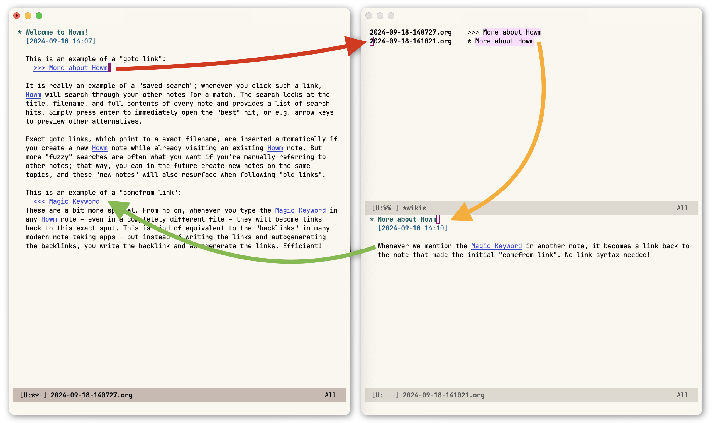

# howm: Write fragmentarily and read collectively.

Howm is a note-taking tool on Emacs. It is similar to emacs-wiki.el; you can enjoy hyperlinks and full-text search easily. It is not similar to emacs-wiki.el; it can be combined with any format.

* [Home](https://kaorahi.github.io/howm/)
* [Introduction by Leah Neukirchen](https://leahneukirchen.org/blog/archive/2022/03/note-taking-in-emacs-with-howm.html) (thx!)
* [Detailed English & Russian tutorials by Andrei Sukhovskii](https://github.com/Emacs101/howm-manual) (thx!)
<!-- * [1-minute introduction on YouTube under Emacs Elements channel](https://www.youtube.com/watch?v=cCflzhDelvg) (unavailable? [2024-09-07]) -->

The following screenshot illustrates the Howm linking system:


(Colorscheme: [Modus themes](https://github.com/protesilaos/modus-themes/issues/118#issuecomment-2337993946).)

## Quick start

If you're using a recent version of Emacs and have enabled the [MELPA](https://melpa.org/) community package repository, you can simply place the following in your `~/.config/emacs/init.el` configuration file and restart Emacs:

```emacs-lisp
(use-package howm
  :ensure t)
```

After that, you can press e.g. `C-c , ,` to open the main menu, `C-c , a` to see a list of all your notes, or `C-c , c` to capture a new note from anywhere. See the documentation links above for more detailed instructions on how to use Howm.

By default, notes are stored in plaintext `*.txt` format in the folder `~/howm`. However, it is possible to write notes in [`markdown-mode`](https://jblevins.org/projects/markdown-mode/) (must be installed separately) and save these files elsewhere. Below is a simple example:

```emacs-lisp
(use-package howm
  :ensure t
  :init
  ;; Where to store the files?
  (setq howm-directory "~/Documents/Howm")
  (setq howm-home-directory howm-directory)
  ;; What format to use for the files?
  (setq howm-file-name-format "%Y-%m-%d-%H%M%S.md")
  (setq howm-view-title-header "#"))
```

Alternatively, if you prefer integrating with e.g. [Org-mode](https://orgmode.org/) (just replace `C-c ,` with `C-c ;` in Howm's documentation):

```emacs-lisp
(use-package howm
  :ensure t
  :init
  ;; Where to store the files?
  (setq howm-directory "~/Documents/Howm")
  (setq howm-home-directory howm-directory)
  ;; What format to use for the files?
  (setq howm-file-name-format "%Y-%m-%d-%H%M%S.org")
  (setq howm-view-title-header "*")
  (setq howm-dtime-format "<%Y-%m-%d %a %H:%M>")
  ;; Avoid conflicts with Org-mode by changing Howm's prefix from "C-c ,".
  (setq howm-prefix (kbd "C-c ;"))
  :bind*
  ;; Conveniently open the Howm menu with "C-c ; ;".
  ("C-c ; ;" . howm-menu))
```

## Project history

* 2002-05-29 initial release (v0.1) on sourceforge.jp
* ...
* 2023-02-18 v1.5.1-snapshot4 on [OSDN](https://howm.osdn.jp/) (renamed from sourceforge.jp)
* 2023-05-13 moved the repository to [GitHub](https://github.com/kaorahi/howm)
* 2023-07-30 moved the project home to [GitHub](https://kaorahi.github.io/howm/)
